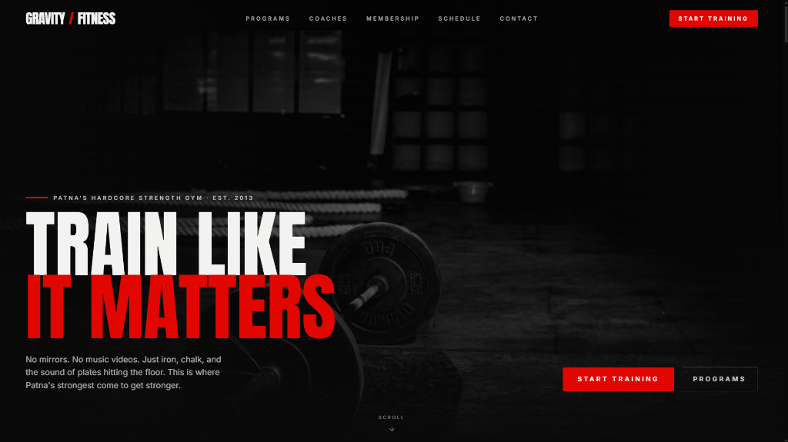
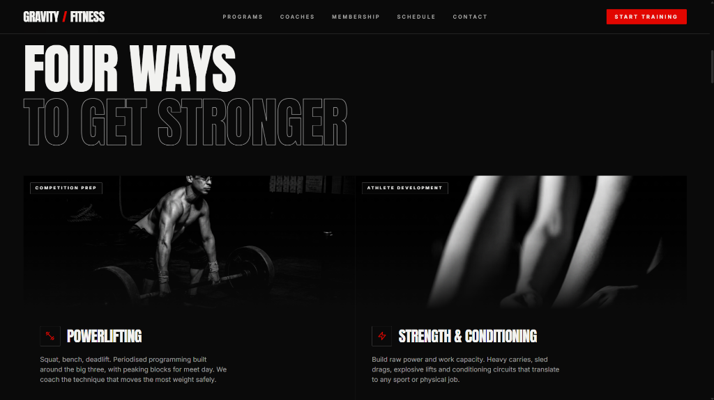
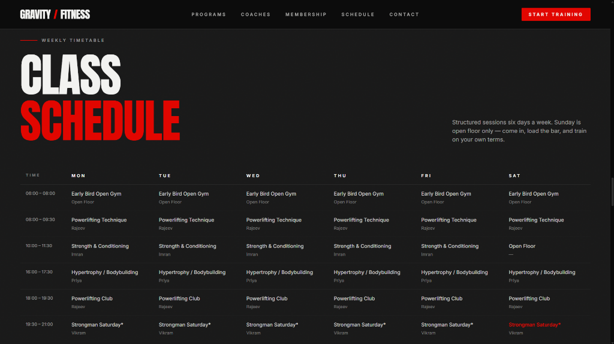
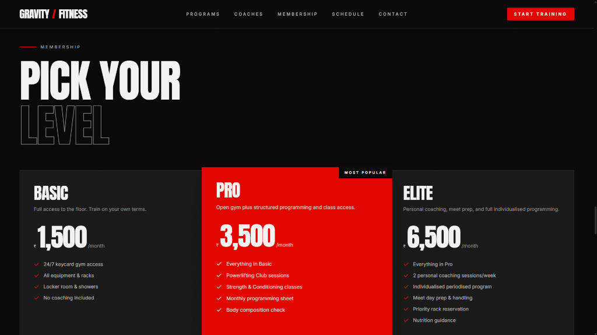
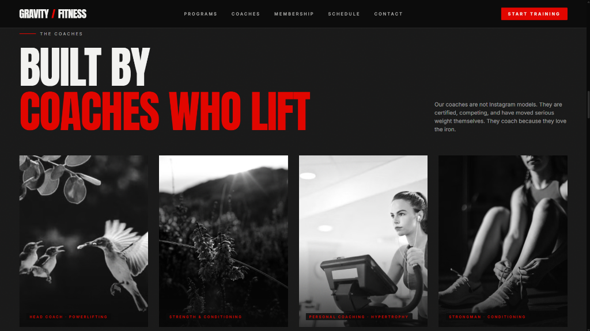

# 🏋️‍♂️ Gravity Fitness Gym

A premium, hardcore web application for **Gravity Fitness Gym** in Patna — the ultimate training ground for powerlifters, strongmen, and strength athletes. Built with a focus on raw aesthetics, premium dark-mode visuals, and smooth interactive elements.

---

## 📸 Quick Preview

Below are screenshots of the key sections of the web application:

<table>
  <tr>
    <td align="center"><b>🔥 Hero Section</b></td>
    <td align="center"><b>💪 Programs</b></td>
  </tr>
  <tr>
    <td></td>
    <td></td>
  </tr>
  <tr>
    <td align="center"><b>📅 Class Schedule</b></td>
    <td align="center"><b>🎟️ Membership Plans</b></td>
  </tr>
  <tr>
    <td></td>
    <td></td>
  </tr>
  <tr>
    <td colspan="2" align="center"><b>🧠 Coaches</b></td>
  </tr>
  <tr>
    <td colspan="2" align="center"></td>
  </tr>
</table>

---

## ✨ Features

- **Modern Dark & Hardcore Aesthetic**: Custom dark color palette (`ink` & `ash` gray shades) highlighted with high-contrast `blood` red accents.
- **Cinematic Film Grain Overlay**: Immersive visual atmosphere utilizing a high-performance SVG noise overlay.
- **Sleek Custom Scrollbar**: Premium custom scrollbar matching the dark theme of the website with animated hover transitions to the signature red color.
- **Interactive Component Layouts**:
  - **Programs Grid**: Spotlighting Powerlifting, Strength & Conditioning, Bodybuilding, etc.
  - **Coaches Profiles**: Displaying the lifting credentials and specializations of the training team.
  - **Interactive Timetable**: Clean horizontal scrollable timetable displaying weekly class slots.
  - **Membership Packages**: Visual tier cards comparing Basic, Pro, and Elite levels.
  - **Contact & Enquiries Form**: Fully functional lead generation form integrated with a backend database.
- **Framer Motion Animations**: Reveal animations and scroll-triggered transitions for interactive feedback.

---

## 🛠️ Tech Stack

- **Frontend Core**: [React 18](https://react.dev/) & [TypeScript](https://www.typescriptlang.org/)
- **Bundler**: [Vite](https://vite.dev/)
- **Styling**: [Tailwind CSS](https://tailwindcss.com/) (with custom extensions)
- **Icons**: [Lucide React](https://lucide.dev/)
- **Animations**: [Framer Motion](https://www.framer.com/motion/)
- **Backend/Database Integration**: [Supabase Client](https://supabase.com/)

---

## 🚀 Getting Started

Follow these steps to run the project locally on your machine:

### 1. Prerequisites
Make sure you have [Node.js](https://nodejs.org/) installed (v18+ recommended).

### 2. Installation
Clone the repository and install the dependencies:
```bash
git clone https://github.com/cipher-team-1007/fitness-iron-core.git
cd fitness-iron-core
npm install
```

### 3. Environment Setup
Create a `.env` file in the root directory and add your Supabase credentials:
```env
VITE_SUPABASE_URL=your_supabase_url
VITE_SUPABASE_ANON_KEY=your_supabase_anon_key
```

### 4. Running the Development Server
Start the Vite local dev server:
```bash
npm run dev
```
Open your browser and navigate to `http://localhost:5173`.

### 5. Build for Production
To build the application for deployment:
```bash
npm run build
```
The output files will be generated inside the `dist/` directory.

---

## 📂 Project Structure

```text
fitness-iron-core/
├── screenshots/          # Web previews and images for documentation
├── src/
│   ├── components/       # Reusable React components (Navbar, Hero, Stats, etc.)
│   ├── hooks/            # Custom hooks (e.g. useCountUp for numbers)
│   ├── lib/              # Library clients (Supabase setup)
│   ├── App.tsx           # Main application shell
│   ├── index.css         # Tailwind directives & global custom styles (scrollbar, etc.)
│   └── main.tsx          # Application entry point
├── supabase/             # Database migrations and configurations
├── tailwind.config.js    # Design system tokens (colors, font-families, layouts)
├── vite.config.ts        # Vite environment configs
└── package.json          # Node dependencies and scripts
```
